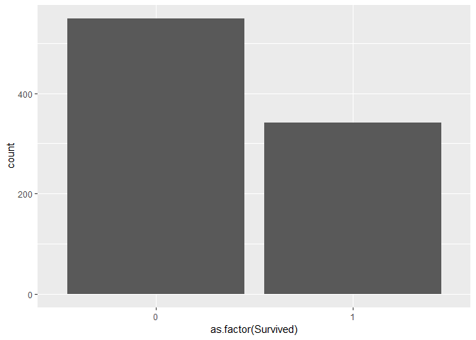
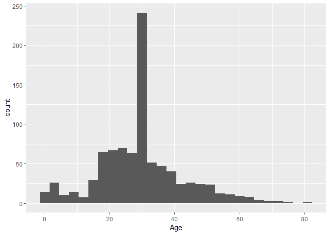
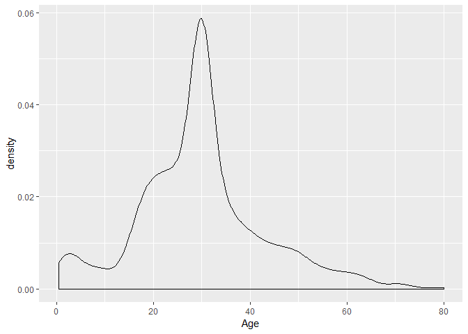
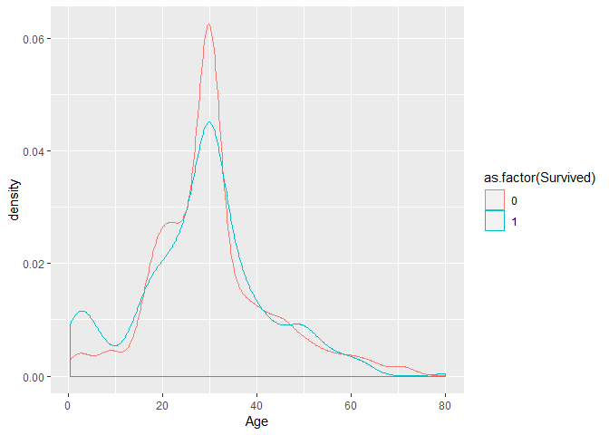
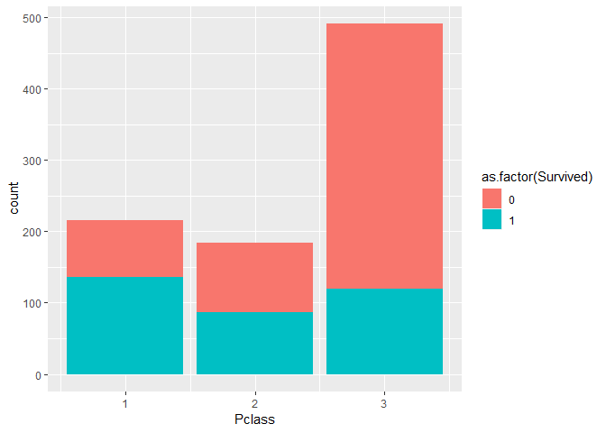
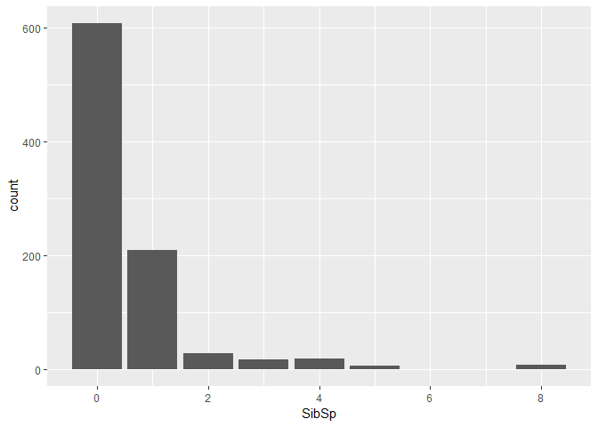
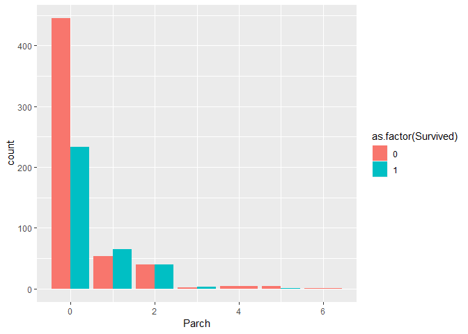
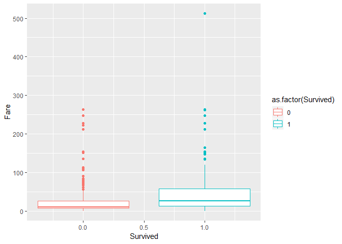
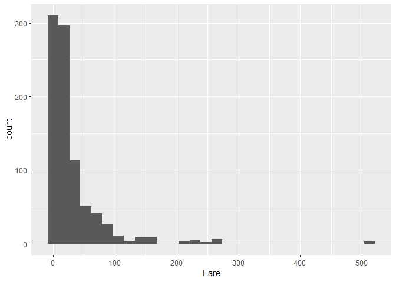
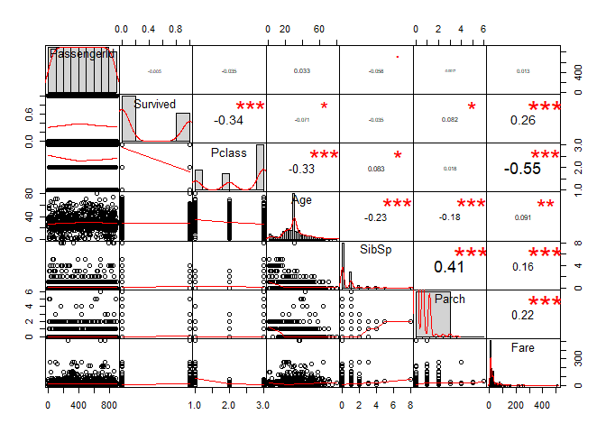

Titanic Kaggle EDA and Modelling
================
Holt Williams
October 3, 2018

Titanic Dataset
---------------

This is an R Markdown document that combines the scripts within this repository into one cohesive story. We will begin with simple Exploratory Data Analysis of the train and test data sets for the Kaggle Titanic Competition.

To begin we run head() to see the general shape and types of data present

``` r
nrow(train)
```

    ## [1] 891

``` r
nrow(test)
```

    ## [1] 418

``` r
head(train)
```

    ##   PassengerId Survived Pclass
    ## 1           1        0      3
    ## 2           2        1      1
    ## 3           3        1      3
    ## 4           4        1      1
    ## 5           5        0      3
    ## 6           6        0      3
    ##                                                  Name    Sex Age SibSp
    ## 1                             Braund, Mr. Owen Harris   male  22     1
    ## 2 Cumings, Mrs. John Bradley (Florence Briggs Thayer) female  38     1
    ## 3                              Heikkinen, Miss. Laina female  26     0
    ## 4        Futrelle, Mrs. Jacques Heath (Lily May Peel) female  35     1
    ## 5                            Allen, Mr. William Henry   male  35     0
    ## 6                                    Moran, Mr. James   male  NA     0
    ##   Parch           Ticket    Fare Cabin Embarked
    ## 1     0        A/5 21171  7.2500              S
    ## 2     0         PC 17599 71.2833   C85        C
    ## 3     0 STON/O2. 3101282  7.9250              S
    ## 4     0           113803 53.1000  C123        S
    ## 5     0           373450  8.0500              S
    ## 6     0           330877  8.4583              Q

``` r
head(test)
```

    ##   PassengerId Pclass                                         Name    Sex
    ## 1         892      3                             Kelly, Mr. James   male
    ## 2         893      3             Wilkes, Mrs. James (Ellen Needs) female
    ## 3         894      2                    Myles, Mr. Thomas Francis   male
    ## 4         895      3                             Wirz, Mr. Albert   male
    ## 5         896      3 Hirvonen, Mrs. Alexander (Helga E Lindqvist) female
    ## 6         897      3                   Svensson, Mr. Johan Cervin   male
    ##    Age SibSp Parch  Ticket    Fare Cabin Embarked
    ## 1 34.5     0     0  330911  7.8292              Q
    ## 2 47.0     1     0  363272  7.0000              S
    ## 3 62.0     0     0  240276  9.6875              Q
    ## 4 27.0     0     0  315154  8.6625              S
    ## 5 22.0     1     1 3101298 12.2875              S
    ## 6 14.0     0     0    7538  9.2250              S

Summary() is useful to see basic information on each column,and it also informs us if there are any missing values.

``` r
summary(train)
```

    ##   PassengerId       Survived          Pclass     
    ##  Min.   :  1.0   Min.   :0.0000   Min.   :1.000  
    ##  1st Qu.:223.5   1st Qu.:0.0000   1st Qu.:2.000  
    ##  Median :446.0   Median :0.0000   Median :3.000  
    ##  Mean   :446.0   Mean   :0.3838   Mean   :2.309  
    ##  3rd Qu.:668.5   3rd Qu.:1.0000   3rd Qu.:3.000  
    ##  Max.   :891.0   Max.   :1.0000   Max.   :3.000  
    ##                                                  
    ##                                     Name         Sex           Age       
    ##  Abbing, Mr. Anthony                  :  1   female:314   Min.   : 0.42  
    ##  Abbott, Mr. Rossmore Edward          :  1   male  :577   1st Qu.:20.12  
    ##  Abbott, Mrs. Stanton (Rosa Hunt)     :  1                Median :28.00  
    ##  Abelson, Mr. Samuel                  :  1                Mean   :29.70  
    ##  Abelson, Mrs. Samuel (Hannah Wizosky):  1                3rd Qu.:38.00  
    ##  Adahl, Mr. Mauritz Nils Martin       :  1                Max.   :80.00  
    ##  (Other)                              :885                NA's   :177    
    ##      SibSp           Parch             Ticket         Fare       
    ##  Min.   :0.000   Min.   :0.0000   1601    :  7   Min.   :  0.00  
    ##  1st Qu.:0.000   1st Qu.:0.0000   347082  :  7   1st Qu.:  7.91  
    ##  Median :0.000   Median :0.0000   CA. 2343:  7   Median : 14.45  
    ##  Mean   :0.523   Mean   :0.3816   3101295 :  6   Mean   : 32.20  
    ##  3rd Qu.:1.000   3rd Qu.:0.0000   347088  :  6   3rd Qu.: 31.00  
    ##  Max.   :8.000   Max.   :6.0000   CA 2144 :  6   Max.   :512.33  
    ##                                   (Other) :852                   
    ##          Cabin     Embarked
    ##             :687    :  2   
    ##  B96 B98    :  4   C:168   
    ##  C23 C25 C27:  4   Q: 77   
    ##  G6         :  4   S:644   
    ##  C22 C26    :  3           
    ##  D          :  3           
    ##  (Other)    :186

``` r
summary(test)
```

    ##   PassengerId         Pclass     
    ##  Min.   : 892.0   Min.   :1.000  
    ##  1st Qu.: 996.2   1st Qu.:1.000  
    ##  Median :1100.5   Median :3.000  
    ##  Mean   :1100.5   Mean   :2.266  
    ##  3rd Qu.:1204.8   3rd Qu.:3.000  
    ##  Max.   :1309.0   Max.   :3.000  
    ##                                  
    ##                                         Name         Sex     
    ##  Abbott, Master. Eugene Joseph            :  1   female:152  
    ##  Abelseth, Miss. Karen Marie              :  1   male  :266  
    ##  Abelseth, Mr. Olaus Jorgensen            :  1               
    ##  Abrahamsson, Mr. Abraham August Johannes :  1               
    ##  Abrahim, Mrs. Joseph (Sophie Halaut Easu):  1               
    ##  Aks, Master. Philip Frank                :  1               
    ##  (Other)                                  :412               
    ##       Age            SibSp            Parch             Ticket   
    ##  Min.   : 0.17   Min.   :0.0000   Min.   :0.0000   PC 17608:  5  
    ##  1st Qu.:21.00   1st Qu.:0.0000   1st Qu.:0.0000   113503  :  4  
    ##  Median :27.00   Median :0.0000   Median :0.0000   CA. 2343:  4  
    ##  Mean   :30.27   Mean   :0.4474   Mean   :0.3923   16966   :  3  
    ##  3rd Qu.:39.00   3rd Qu.:1.0000   3rd Qu.:0.0000   220845  :  3  
    ##  Max.   :76.00   Max.   :8.0000   Max.   :9.0000   347077  :  3  
    ##  NA's   :86                                        (Other) :396  
    ##       Fare                     Cabin     Embarked
    ##  Min.   :  0.000                  :327   C:102   
    ##  1st Qu.:  7.896   B57 B59 B63 B66:  3   Q: 46   
    ##  Median : 14.454   A34            :  2   S:270   
    ##  Mean   : 35.627   B45            :  2           
    ##  3rd Qu.: 31.500   C101           :  2           
    ##  Max.   :512.329   C116           :  2           
    ##  NA's   :1         (Other)        : 80

``` r
str(train)
```

    ## 'data.frame':    891 obs. of  12 variables:
    ##  $ PassengerId: int  1 2 3 4 5 6 7 8 9 10 ...
    ##  $ Survived   : int  0 1 1 1 0 0 0 0 1 1 ...
    ##  $ Pclass     : int  3 1 3 1 3 3 1 3 3 2 ...
    ##  $ Name       : Factor w/ 891 levels "Abbing, Mr. Anthony",..: 109 191 358 277 16 559 520 629 417 581 ...
    ##  $ Sex        : Factor w/ 2 levels "female","male": 2 1 1 1 2 2 2 2 1 1 ...
    ##  $ Age        : num  22 38 26 35 35 NA 54 2 27 14 ...
    ##  $ SibSp      : int  1 1 0 1 0 0 0 3 0 1 ...
    ##  $ Parch      : int  0 0 0 0 0 0 0 1 2 0 ...
    ##  $ Ticket     : Factor w/ 681 levels "110152","110413",..: 524 597 670 50 473 276 86 396 345 133 ...
    ##  $ Fare       : num  7.25 71.28 7.92 53.1 8.05 ...
    ##  $ Cabin      : Factor w/ 148 levels "","A10","A14",..: 1 83 1 57 1 1 131 1 1 1 ...
    ##  $ Embarked   : Factor w/ 4 levels "","C","Q","S": 4 2 4 4 4 3 4 4 4 2 ...

map() is also useful for this function

``` r
map(train, ~sum(is.na(.)))
```

    ## $PassengerId
    ## [1] 0
    ## 
    ## $Survived
    ## [1] 0
    ## 
    ## $Pclass
    ## [1] 0
    ## 
    ## $Name
    ## [1] 0
    ## 
    ## $Sex
    ## [1] 0
    ## 
    ## $Age
    ## [1] 177
    ## 
    ## $SibSp
    ## [1] 0
    ## 
    ## $Parch
    ## [1] 0
    ## 
    ## $Ticket
    ## [1] 0
    ## 
    ## $Fare
    ## [1] 0
    ## 
    ## $Cabin
    ## [1] 0
    ## 
    ## $Embarked
    ## [1] 0

``` r
map(test, ~sum(is.na(.)))
```

    ## $PassengerId
    ## [1] 0
    ## 
    ## $Pclass
    ## [1] 0
    ## 
    ## $Name
    ## [1] 0
    ## 
    ## $Sex
    ## [1] 0
    ## 
    ## $Age
    ## [1] 86
    ## 
    ## $SibSp
    ## [1] 0
    ## 
    ## $Parch
    ## [1] 0
    ## 
    ## $Ticket
    ## [1] 0
    ## 
    ## $Fare
    ## [1] 1
    ## 
    ## $Cabin
    ## [1] 0
    ## 
    ## $Embarked
    ## [1] 0

From here we can see that age is missing multiple values in each dataset, and Fare ismissing one value within the test dataset. To make our analysis simple we will fill the missing Fare value with the mean for the data as it will cause issues later on in our modellign steps

``` r
test$Fare[is.na(test$Fare)]<- mean(test$Fare, na.rm=TRUE)
```

To fill the missing Age values we do the same thing:

``` r
train$Age[is.na(train$Age)]<- round(mean(train$Age, na.rm=TRUE))
test$Age[is.na(test$Age)]<- round(mean(test$Age, na.rm=TRUE))
```

Rerunning the previous map() functions we now have

``` r
map(train, ~sum(is.na(.)))
```

    ## $PassengerId
    ## [1] 0
    ## 
    ## $Survived
    ## [1] 0
    ## 
    ## $Pclass
    ## [1] 0
    ## 
    ## $Name
    ## [1] 0
    ## 
    ## $Sex
    ## [1] 0
    ## 
    ## $Age
    ## [1] 0
    ## 
    ## $SibSp
    ## [1] 0
    ## 
    ## $Parch
    ## [1] 0
    ## 
    ## $Ticket
    ## [1] 0
    ## 
    ## $Fare
    ## [1] 0
    ## 
    ## $Cabin
    ## [1] 0
    ## 
    ## $Embarked
    ## [1] 0

``` r
map(test, ~sum(is.na(.)))
```

    ## $PassengerId
    ## [1] 0
    ## 
    ## $Pclass
    ## [1] 0
    ## 
    ## $Name
    ## [1] 0
    ## 
    ## $Sex
    ## [1] 0
    ## 
    ## $Age
    ## [1] 0
    ## 
    ## $SibSp
    ## [1] 0
    ## 
    ## $Parch
    ## [1] 0
    ## 
    ## $Ticket
    ## [1] 0
    ## 
    ## $Fare
    ## [1] 0
    ## 
    ## $Cabin
    ## [1] 0
    ## 
    ## $Embarked
    ## [1] 0

Survived
--------

Now we can look at each variable individually to see its characteristics, beginning with the outcome variable: Survived. Here, a 0 indicates an individual perished while a 1 means they survived. Below youcan see many more indivduals perished (549) to survived (342).

    ## 
    ##   0   1 
    ## 549 342

    ## Warning: Ignoring unknown parameters: binwidth, bins, pad



Age
---

Here is a simple distribution of age

``` r
train%>%ggplot()+geom_histogram(aes(Age), binwidth=3)
```



``` r
train%>%ggplot(aes(Age))+geom_density()
```



``` r
train%>%ggplot(aes(Age, colour=as.factor(Survived)))+geom_density()
```



Pclass
------

This is a measure of the class of a passenger: 1, 2, or 3 class

``` r
train%>%ggplot(aes(Pclass))+geom_bar()
```


``` r
train%>%ggplot(aes(Pclass, fill=as.factor(Survived)))+geom_bar()
```



SibSp
-----

``` r
train%>%ggplot(aes(SibSp))+geom_bar()
```



Parch
-----

``` r
train%>%ggplot(aes(Parch, fill=as.factor(Survived)))+geom_bar(position="dodge")
```



Fare
----

``` r
train%>%ggplot(aes(Survived,Fare, colour=as.factor(Survived)))+geom_boxplot()
```



``` r
train%>%ggplot(aes(Fare))+geom_histogram()
```

    ## `stat_bin()` using `bins = 30`. Pick better value with `binwidth`.



It can beneficail to look at the correlations ofdiffrent varaibles:

``` r
cor(train[,unlist(lapply(train, is.numeric))])
```

    ##              PassengerId     Survived      Pclass         Age       SibSp
    ## PassengerId  1.000000000 -0.005006661 -0.03514399  0.03301883 -0.05752683
    ## Survived    -0.005006661  1.000000000 -0.33848104 -0.07065723 -0.03532250
    ## Pclass      -0.035143994 -0.338481036  1.00000000 -0.32972711  0.08308136
    ## Age          0.033018832 -0.070657231 -0.32972711  1.00000000 -0.23243953
    ## SibSp       -0.057526834 -0.035322499  0.08308136 -0.23243953  1.00000000
    ## Parch       -0.001652012  0.081629407  0.01844267 -0.18032972  0.41483770
    ## Fare         0.012658219  0.257306522 -0.54949962  0.09063187  0.15965104
    ##                    Parch        Fare
    ## PassengerId -0.001652012  0.01265822
    ## Survived     0.081629407  0.25730652
    ## Pclass       0.018442671 -0.54949962
    ## Age         -0.180329718  0.09063187
    ## SibSp        0.414837699  0.15965104
    ## Parch        1.000000000  0.21622494
    ## Fare         0.216224945  1.00000000

``` r
chart.Correlation(train[,unlist(lapply(train, is.numeric))])
```


